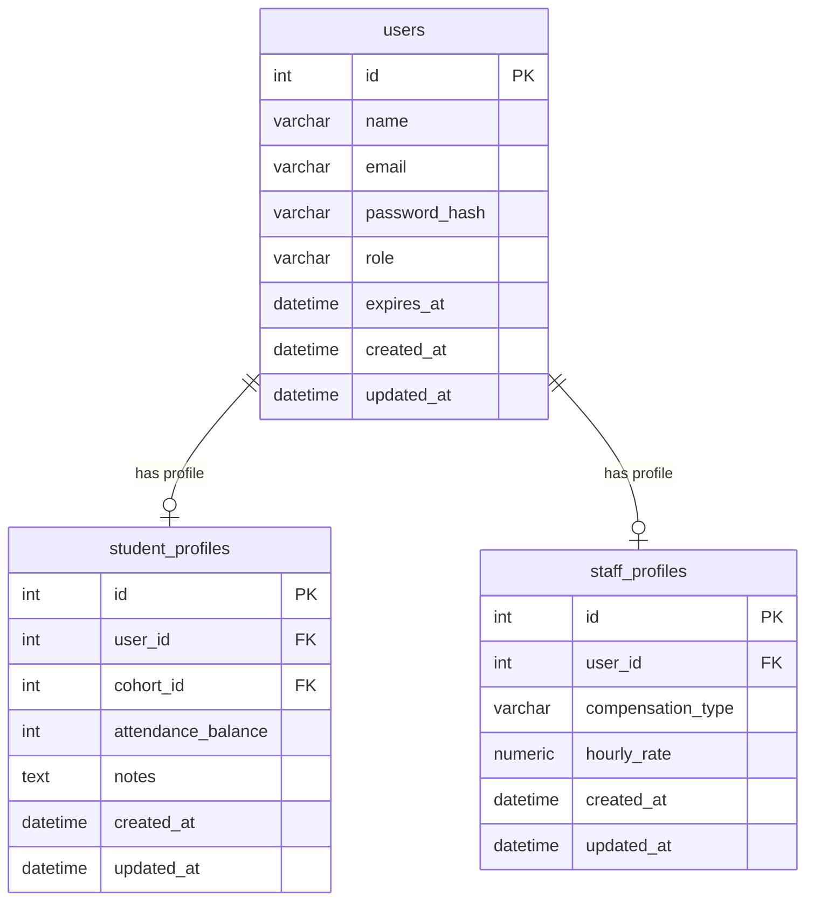
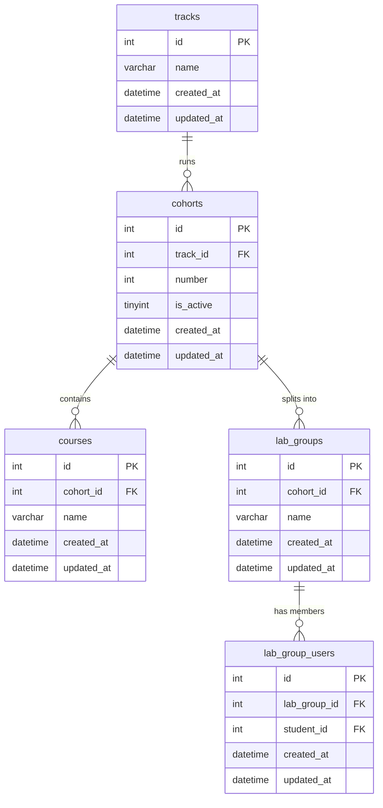
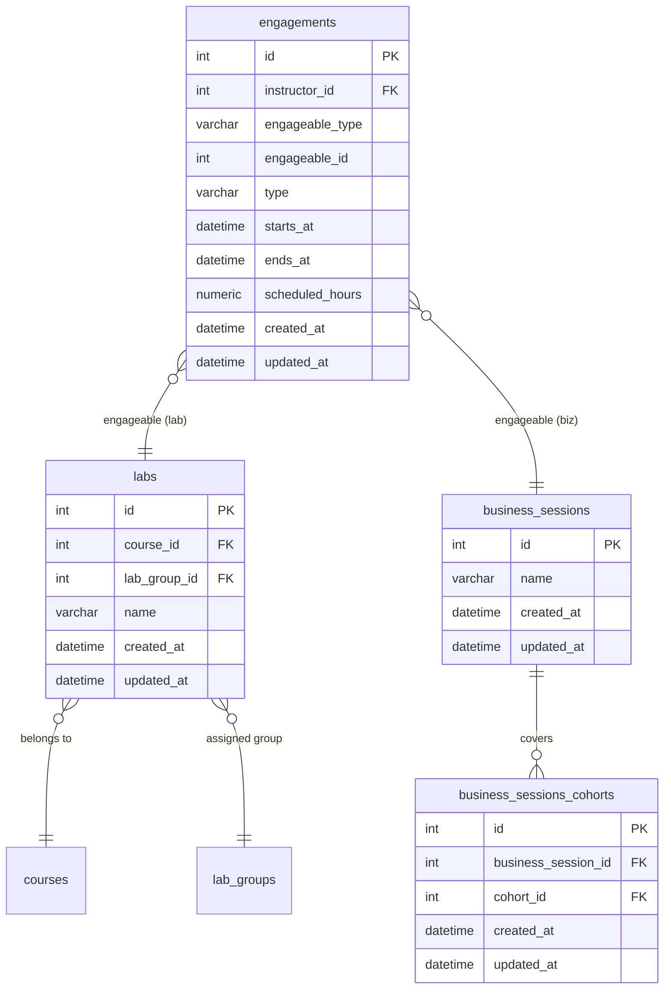
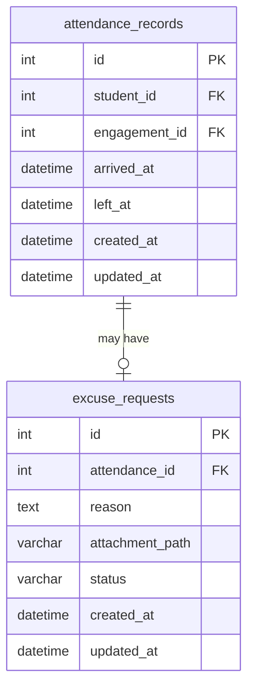
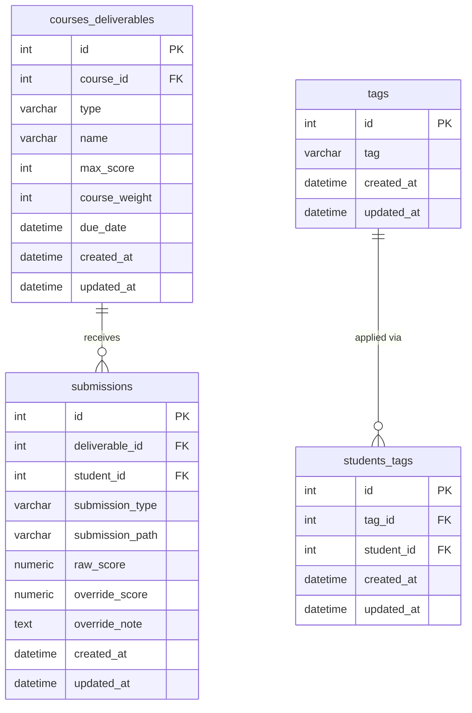

# Attendance & Grading Platform — Laravel 13 API

A stateless, headless REST API backend built with **Laravel 13**, **PHP 8.3**, and **PostgreSQL**.  
Designed to serve a separate Vue frontend. No sessions, no Blade, no assets — pure JSON.

---

## Table of Contents

- [Requirements](#-requirements)
- [Project Setup](#-project-setup)
- [Environment Reference](#-environment-reference)
- [Authentication](#-authentication-sanctum-api-tokens)
- [API Design Guidelines](#-api-design-guidelines)
- [Database Schema](#-database-schema)
- [Project Structure](#-project-structure)
- [Error Handling](#-error-handling)
- [Testing](#-testing)
- [Maintenance Commands](#-maintenance-commands)
- [Contributor Guidelines](#-contributor-guidelines)
- [Related Repositories](#-related-repositories)

---

## 📋 Requirements

| Requirement | Version |
|-------------|---------|
| PHP | 8.3+ |
| Composer | 2.x |
| PostgreSQL | 15 / 16 |
| Git | latest |

---

## 🚀 Project Setup

### 1. Clone the repository

```bash
git clone https://github.com/AndrewEmad14/attendance-and-grading-platform-backend
cd attendance-and-grading-platform-backend
```

### 2. Copy environment file

```bash
cp .env.example .env
```

### 3. Install PHP dependencies

```bash
composer install --optimize-autoloader
```

> For CI / production, add `--no-dev` to exclude dev-only packages.

### 4. Generate application key

```bash
php artisan key:generate
```

### 5. Configure your `.env`

Fill in at minimum:

```dotenv
APP_NAME="Attendance & Grading Platform"
APP_ENV=local
APP_DEBUG=true
APP_URL=http://localhost:8000

DB_CONNECTION=pgsql
DB_HOST=127.0.0.1
DB_PORT=5432
DB_DATABASE=your_db_name
DB_USERNAME=your_db_user
DB_PASSWORD=your_db_password

SANCTUM_STATEFUL_DOMAINS=localhost:5173  # Your Vue dev server
```

### 6. Run migrations

```bash
php artisan migrate --force
```

### 7. Publish and run Sanctum migrations

```bash
php artisan vendor:publish --tag=sanctum-migrations
php artisan migrate
```

### 8. (Optional) Seed initial data

```bash
php artisan db:seed --force
```

### 9. Start the development server

```bash
php artisan serve
```

API is now available at `http://127.0.0.1:8000/api`.

---

## 🌍 Environment Reference

| Variable | Description | Example |
|----------|-------------|---------|
| `APP_ENV` | Environment (`local`, `production`) | `local` |
| `APP_DEBUG` | Enable debug output — **never `true` in prod** | `false` |
| `APP_URL` | Full base URL of the API | `https://api.example.com` |
| `DB_CONNECTION` | Database driver | `pgsql` |
| `DB_HOST` | Database host | `127.0.0.1` |
| `DB_PORT` | Database port | `5432` |
| `DB_DATABASE` | Database name | `attendance_db` |
| `DB_USERNAME` | Database user | `laravel_api` |
| `DB_PASSWORD` | Database password | _(strong secret)_ |
| `SANCTUM_STATEFUL_DOMAINS` | Trusted frontend origins | `localhost:5173` |
| `LOG_CHANNEL` | Log driver | `stack` |
| `QUEUE_CONNECTION` | Queue driver | `sync` / `redis` |

> Never commit `.env` to version control. The `.env.example` file is the single source of truth for required variables. Always update `.env.example` when you add a new variable.

---

## 🔐 Authentication (Sanctum API Tokens)

This project uses **Laravel Sanctum** in **API token mode** (not cookie/session mode).

### How it works

1. Client sends credentials to `POST /api/auth/login`.
2. Server validates, creates a token, and returns it.
3. All subsequent requests include the token in the `Authorization` header.

### Token issuance

```php
$token = $user->createToken('api-token', ['*'])->plainTextToken;

return response()->json([
    'token'      => $token,
    'token_type' => 'Bearer',
]);
```

### Protected routes

```php
// routes/api.php
Route::middleware('auth:sanctum')->group(function () {
    Route::get('/user', fn (Request $r) => new UserResource($r->user()));
    // ...all other protected routes
});
```

### Client usage

```http
Authorization: Bearer 1|xxxxxxxxxxxxxxxxxxxxxxxxxxxxxxxxxxxxxxxx
Accept: application/json
Content-Type: application/json
```

### Token abilities (optional scoping)

```php
// Issue a scoped token
$user->createToken('api-token', ['students:read', 'grades:write']);

// Check ability in a controller
$request->user()->tokenCan('grades:write');
```

### Logout (token revocation)

```php
// Revoke current token only
$request->user()->currentAccessToken()->delete();

// Revoke all tokens (logout everywhere)
$request->user()->tokens()->delete();
```

### Public routes (no token required)

```
POST /api/auth/login
POST /api/auth/register
POST /api/auth/forgot-password
POST /api/auth/reset-password
```

---

## 📐 API Design Guidelines

This section defines how every endpoint in this project must be designed. Consistency is non-negotiable — all contributors must follow these rules.

---

### URL & Verb Conventions

Use **resource-based, plural noun** URLs. Never put verbs in URLs.

| Action | Method | URL |
|--------|--------|-----|
| List all | `GET` | `/api/students` |
| Show one | `GET` | `/api/students/{id}` |
| Create | `POST` | `/api/students` |
| Full replace | `PUT` | `/api/students/{id}` |
| Partial update | `PATCH` | `/api/students/{id}` |
| Delete | `DELETE` | `/api/students/{id}` |

**Nested resources** (max 2 levels deep):

```
GET  /api/courses/{course}/students       # Students enrolled in a course
POST /api/courses/{course}/attendance     # Record attendance for a course session
GET  /api/students/{student}/grades       # All grades for a student
```

**Actions that don't map to CRUD** — use a sub-resource noun, not a verb:

```
POST /api/attendance/{id}/approve         ✅
POST /api/approveAttendance/{id}          ❌ verb in URL
```

---

### Response Structure

Every response must follow this envelope. No exceptions.

#### Success — single resource

```json
{
  "data": {
    "id": 1,
    "name": "Ahmed Hassan",
    "email": "ahmed@example.com",
    "created_at": "2024-09-01T09:00:00Z"
  }
}
```

#### Success — paginated collection

```json
{
  "data": [
    { "id": 1, "name": "Ahmed Hassan" },
    { "id": 2, "name": "Sara Ali" }
  ],
  "meta": {
    "current_page": 1,
    "last_page": 4,
    "per_page": 15,
    "total": 60
  },
  "links": {
    "first": "/api/students?page=1",
    "last":  "/api/students?page=4",
    "prev":  null,
    "next":  "/api/students?page=2"
  }
}
```

#### Error

```json
{
  "message": "The given data was invalid.",
  "errors": {
    "email": ["The email field is required."],
    "grade": ["The grade must be between 0 and 100."]
  }
}
```

---

### HTTP Status Codes

| Situation | Code |
|-----------|------|
| Successful GET / PATCH | `200 OK` |
| Successful POST (created) | `201 Created` |
| Successful DELETE / action with no body | `204 No Content` |
| Validation failed | `422 Unprocessable Entity` |
| Unauthenticated (missing or invalid token) | `401 Unauthorized` |
| Authenticated but forbidden | `403 Forbidden` |
| Resource not found | `404 Not Found` |
| Rate limit exceeded | `429 Too Many Requests` |
| Server error | `500 Internal Server Error` |

---

### Controllers

Controllers must be **thin** — they orchestrate, not implement. Business logic lives in Services.

```php
// ✅ Correct — thin controller
class AttendanceController extends Controller
{
    public function store(StoreAttendanceRequest $request, AttendanceService $service): JsonResponse
    {
        $record = $service->record($request->validated(), $request->user());

        return (new AttendanceResource($record))
            ->response()
            ->setStatusCode(201);
    }
}

// ❌ Wrong — fat controller with inline logic
class AttendanceController extends Controller
{
    public function store(Request $request): JsonResponse
    {
        // validation here, DB queries here, business rules here, emails here...
        return response()->json($result);
    }
}
```

Use **single-action controllers** for complex or standalone operations:

```php
// app/Http/Controllers/Api/GenerateReportController.php
class GenerateReportController extends Controller
{
    public function __invoke(GenerateReportRequest $request, ReportService $service): JsonResponse
    {
        return response()->json($service->generate($request->validated()));
    }
}

// routes/api.php
Route::post('/reports/generate', GenerateReportController::class);
```

---

### Form Requests (Validation)

Never validate inside a controller. Every endpoint that accepts input must have its own Form Request class.

```php
// app/Http/Requests/Attendance/StoreAttendanceRequest.php
class StoreAttendanceRequest extends FormRequest
{
    public function authorize(): bool
    {
        // Authorization belongs here, not in the controller
        return $this->user()->can('create', Attendance::class);
    }

    public function rules(): array
    {
        return [
            'session_id' => ['required', 'integer', 'exists:course_sessions,id'],
            'student_id' => ['required', 'integer', 'exists:students,id'],
            'status'     => ['required', 'in:present,absent,late,excused'],
            'notes'      => ['nullable', 'string', 'max:500'],
        ];
    }

    public function messages(): array
    {
        return [
            'status.in' => 'Status must be one of: present, absent, late, excused.',
        ];
    }
}
```

---

### API Resources (Output Transformation)

Never return raw Eloquent models. Every response must go through an API Resource.

```php
// app/Http/Resources/StudentResource.php
class StudentResource extends JsonResource
{
    public function toArray(Request $request): array
    {
        return [
            'id'         => $this->id,
            'name'       => $this->name,
            'email'      => $this->email,
            'student_id' => $this->student_id,
            // whenLoaded() prevents N+1 — only included if eager-loaded
            'courses'    => CourseResource::collection($this->whenLoaded('courses')),
            'created_at' => $this->created_at->toISOString(),
        ];
    }
}

// Paginated collection — wraps automatically in "data"
return StudentResource::collection(Student::paginate(15));

// Single resource
return new StudentResource($student);
```

---

### Services (Business Logic)

Services are plain PHP classes that contain all non-trivial logic. No HTTP concerns, no redirects, no responses — just logic that can be tested in isolation.

```php
// app/Services/AttendanceService.php
class AttendanceService
{
    public function record(array $data, User $instructor): Attendance
    {
        $session = CourseSession::findOrFail($data['session_id']);

        if ($session->instructor_id !== $instructor->id) {
            throw new UnauthorizedException('You do not own this session.');
        }

        if ($session->date->isPast()) {
            throw new AttendanceException('Cannot record attendance for a past session.');
        }

        return DB::transaction(function () use ($data, $session) {
            return Attendance::create([
                'session_id'  => $session->id,
                'student_id'  => $data['student_id'],
                'status'      => $data['status'],
                'recorded_at' => now(),
            ]);
        });
    }
}
```

---

### Policies (Authorization)

Use Laravel Policies for all permission checks. Never hardcode role strings inside controllers.

```php
// app/Policies/GradePolicy.php
class GradePolicy
{
    public function update(User $user, Grade $grade): bool
    {
        return $user->hasRole('instructor')
            && $grade->course->instructor_id === $user->id;
    }

    public function viewAny(User $user): bool
    {
        return $user->hasAnyRole(['admin', 'instructor']);
    }
}

// In a controller
$this->authorize('update', $grade);

// In a Form Request
public function authorize(): bool
{
    return $this->user()->can('update', $this->route('grade'));
}
```

---

### Pagination, Filtering & Sorting

Always paginate. Never return unbounded lists.

```php
public function index(IndexStudentRequest $request): JsonResponse
{
    $students = Student::query()
        ->when($request->filled('search'), fn ($q) =>
            $q->where('name', 'ilike', "%{$request->search}%")
              ->orWhere('email', 'ilike', "%{$request->search}%")
        )
        ->when($request->filled('course_id'), fn ($q) =>
            $q->whereHas('courses', fn ($q) => $q->where('id', $request->course_id))
        )
        ->when($request->filled('sort'), fn ($q) =>
            $q->orderBy($request->sort, $request->get('direction', 'asc'))
        )
        ->with('courses')
        ->paginate($request->get('per_page', 15));

    return StudentResource::collection($students)->response();
}
```

Supported query parameters:

| Parameter | Type | Default | Description |
|-----------|------|---------|-------------|
| `page` | integer | `1` | Page number |
| `per_page` | integer | `15` | Items per page (max: 100) |
| `search` | string | — | Full-text search |
| `sort` | string | — | Column to sort by |
| `direction` | string | `asc` | `asc` or `desc` |

---

### Database Guidelines

```php
// ✅ Always eager load to prevent N+1
$courses = Course::with(['students', 'instructor', 'sessions'])->paginate(15);

// ✅ Use query scopes for reusable filters
// In app/Models/Student.php:
public function scopeActive(Builder $query): Builder
{
    return $query->where('status', 'active');
}
// Usage:
Student::active()->with('courses')->paginate(15);

// ✅ Wrap multi-step writes in a transaction
DB::transaction(function () use ($data) {
    $student = Student::create($data['student']);
    $student->courses()->attach($data['course_ids']);
});

// ❌ Never query inside a loop (N+1)
foreach (Course::all() as $course) {
    echo $course->instructor->name; // 1 query per course
}
```

**Migration conventions:**

```php
Schema::create('attendance', function (Blueprint $table) {
    $table->id();
    $table->foreignId('student_id')->constrained()->cascadeOnDelete();
    $table->foreignId('session_id')->constrained('course_sessions')->cascadeOnDelete();
    $table->enum('status', ['present', 'absent', 'late', 'excused']);
    $table->text('notes')->nullable();
    $table->timestamp('recorded_at');
    $table->timestamps();

    // Composite unique to prevent duplicate records
    $table->unique(['student_id', 'session_id']);

    // Index for common query patterns
    $table->index(['session_id', 'status']);
});
```

---

## 🗄️ Database Schema

The schema is split into five domain groups. Each diagram below shows one group's tables and their relationships. Foreign keys that cross groups (e.g. `engagements.instructor_id → staff_profiles`) are shown as dashed references.

---

### 1. Users & Profiles

Every person in the system is a `users` row. Role-specific data lives in a separate profile table — `student_profiles` for students, `staff_profiles` for all staff (instructors, track admins).



---

### 2. Organization — Tracks, Cohorts & Courses

The hierarchy is: a `track` (e.g. Web Dev) contains `cohorts` (one active at a time), each cohort contains `courses`, and each course is split into `lab_groups` of ~15 students.



---

### 3. Engagements & Scheduling

An `engagement` is a polymorphic teaching booking — it can be attached to a `course`, a `lab`, or a `business_session`. Business sessions can span multiple cohorts via `business_sessions_cohorts`.



> The `engagements.instructor_id` FK references `staff_profiles.id`. The `engagements.engageable_id` + `engageable_type` form a polymorphic relation covering `courses`, `labs`, and `business_sessions`.

---

### 4. Attendance

Every student scan-in/out creates an `attendance_records` row. A student can raise an `excuse_requests` against any attendance record. The Track Admin then approves or rejects it.



> `attendance_records.student_id` → `student_profiles.id`. `attendance_records.engagement_id` → `engagements.id`.

---

### 5. Grading, Submissions & Tags

Each `course` has `courses_deliverables` (labs, exams, projects). Students submit against them in `submissions`. Tags are predefined labels attached to a student via `students_tags`.



> `submissions.student_id` and `students_tags.student_id` both reference `student_profiles.id`. `courses_deliverables.course_id` references `courses.id`.

---

## 📁 Project Structure

```
app/
├── Exceptions/
│   └── Handler.php                  # Maps exceptions to JSON responses
├── Http/
│   ├── Controllers/
│   │   └── Api/
│   │       ├── Auth/                # Login, register, password reset
│   │       ├── AttendanceController.php
│   │       ├── CourseController.php
│   │       ├── GradeController.php
│   │       └── StudentController.php
│   ├── Middleware/
│   │   └── ForceJsonResponse.php    # Ensures Accept: application/json
│   ├── Requests/
│   │   ├── Attendance/
│   │   ├── Course/
│   │   ├── Grade/
│   │   └── Student/
│   └── Resources/
│       ├── AttendanceResource.php
│       ├── CourseResource.php
│       ├── GradeResource.php
│       └── StudentResource.php
├── Models/
├── Policies/
├── Services/
└── Traits/
config/
routes/
├── api.php
└── console.php
database/
├── migrations/
├── seeders/
└── factories/
tests/
├── Feature/
│   └── Api/                         # One file per controller
└── Unit/
    └── Services/                    # Unit tests for Service classes
```

> **Note:** `web.php`, `vite.config.js`, `package.json`, `resources/views/`, and `resources/js/` have been removed — this is a headless API.

---

## ❗ Error Handling

The exception handler must convert **all** exceptions to JSON. HTML error pages must never reach the API client.

```php
// app/Exceptions/Handler.php
public function register(): void
{
    $this->renderable(function (ModelNotFoundException $e) {
        return response()->json(['message' => 'Resource not found.'], 404);
    });

    $this->renderable(function (AuthenticationException $e) {
        return response()->json(['message' => 'Unauthenticated.'], 401);
    });

    // Custom domain exceptions
    $this->renderable(function (AttendanceException $e) {
        return response()->json(['message' => $e->getMessage()], 422);
    });
}
```

Register a `ForceJsonResponse` middleware globally so that Laravel's own validation and auth exceptions always render as JSON:

```php
// app/Http/Middleware/ForceJsonResponse.php
class ForceJsonResponse
{
    public function handle(Request $request, Closure $next): Response
    {
        $request->headers->set('Accept', 'application/json');
        return $next($request);
    }
}
```

---

## 🧪 Testing

Every endpoint **must** have a feature test before it is merged.

### Run all tests

```bash
php artisan test
```

### Run a specific test

```bash
php artisan test --filter=AttendanceTest
php artisan test --filter="AttendanceTest::test_instructor_can_record_attendance"
```

### Feature test structure

```php
// tests/Feature/Api/AttendanceTest.php
class AttendanceTest extends TestCase
{
    use RefreshDatabase;

    public function test_instructor_can_record_attendance(): void
    {
        $instructor = User::factory()->instructor()->create();
        $session    = CourseSession::factory()->for($instructor)->create();
        $student    = Student::factory()->create();

        $this->actingAs($instructor, 'sanctum')
             ->postJson('/api/attendance', [
                 'session_id' => $session->id,
                 'student_id' => $student->id,
                 'status'     => 'present',
             ])
             ->assertStatus(201)
             ->assertJsonPath('data.status', 'present');

        $this->assertDatabaseHas('attendance', [
            'session_id' => $session->id,
            'student_id' => $student->id,
        ]);
    }

    public function test_student_cannot_record_attendance(): void
    {
        $student = User::factory()->student()->create();

        $this->actingAs($student, 'sanctum')
             ->postJson('/api/attendance', [])
             ->assertStatus(403);
    }

    public function test_unauthenticated_request_returns_401(): void
    {
        $this->postJson('/api/attendance', [])->assertStatus(401);
    }

    public function test_invalid_data_returns_422(): void
    {
        $instructor = User::factory()->instructor()->create();

        $this->actingAs($instructor, 'sanctum')
             ->postJson('/api/attendance', ['status' => 'flying'])
             ->assertStatus(422)
             ->assertJsonValidationErrors(['session_id', 'student_id', 'status']);
    }
}
```

### Testing checklist per endpoint

- [ ] Happy path (valid data, correct role) → correct status + response shape
- [ ] Unauthenticated → `401`
- [ ] Wrong role → `403`
- [ ] Invalid input → `422` with correct error keys
- [ ] Non-existent resource → `404`

---

## 🧹 Maintenance Commands

| Command | Purpose |
|---------|---------|
| `php artisan optimize:clear` | Clear all cached config, routes, and views |
| `php artisan config:cache` | Cache configuration for performance |
| `php artisan route:cache` | Cache route list for performance |
| `php artisan route:list` | Inspect all registered API routes |
| `php artisan tinker` | Interactive REPL (avoid in production) |
| `php artisan db:wipe` | Drop all tables — use with caution |
| `php artisan migrate:fresh --seed` | Rebuild DB and reseed (dev only) |

---

## ❗ Contributor Guidelines

### Hard rules

- **Never** use `session()` — this is a stateless API.
- **Never** return `view()` or `redirect()` — always JSON.
- **Never** return raw Eloquent models — always use API Resources.
- **Never** validate inside controllers — always use Form Requests.
- **Never** write business logic in controllers — use Services.
- **Never** query inside a loop — always eager load with `with()`.
- **Never** merge a PR without tests for every endpoint you touched.

### Code style

Follows **PSR-12** and Laravel conventions. Run before committing:

```bash
./vendor/bin/pint
```

### Git workflow

```
main        → production-ready only, protected branch
develop     → integration branch, all PRs target here
feature/xyz → feature branches from develop
fix/xyz     → bug fixes from develop
```

Commit message format:

```
feat: add grade submission endpoint
fix: prevent duplicate attendance records
refactor: move GPA logic into GradeService
test: add coverage for CourseController
```

### PR checklist

- [ ] All tests passing (`php artisan test`)
- [ ] Code formatted (`./vendor/bin/pint`)
- [ ] API Resources used for all output
- [ ] Business logic moved to a Service class if non-trivial
- [ ] `.env.example` updated if new env variables were added
- [ ] Migration `down()` method is correct and reversible

---

## 🔗 Related Repositories

- [**Frontend (Vue) Repo** ](https://github.com/AndrewEmad14/attendance-and-grading-platform-frontend)
- [**Backend (Laravel) Deployed API** ](https://attendance-and-grading-backend-production.up.railway.app/api)
- [**Frontend (Vue) Deployed Website** ](https://attendance-and-grading-platform.vercel.app/)