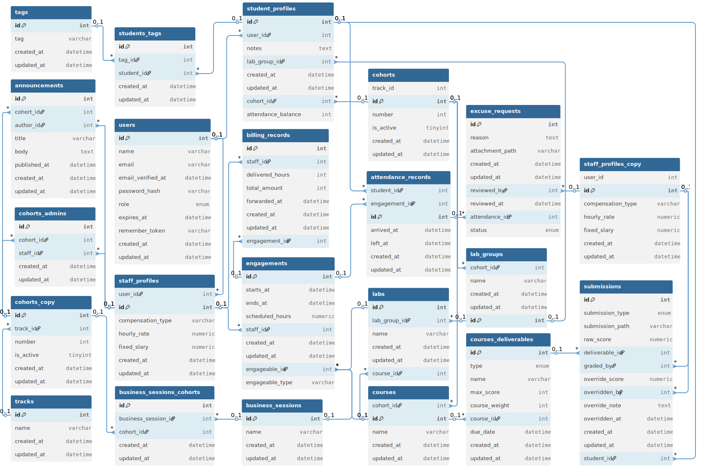
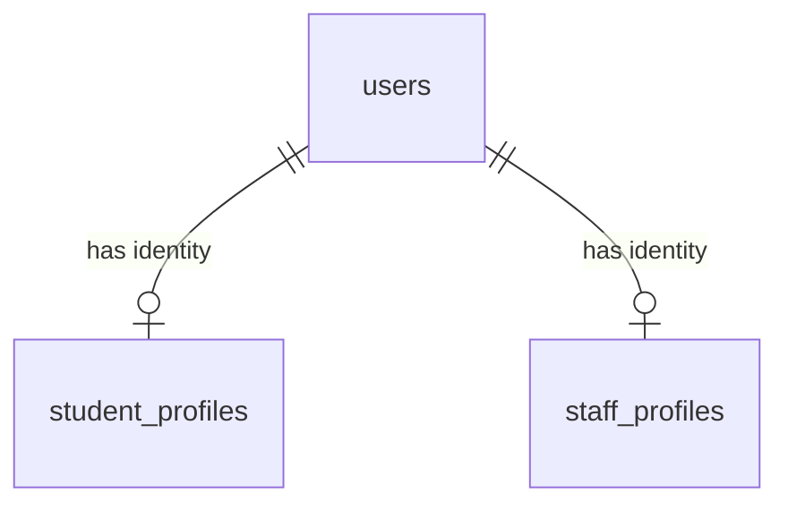
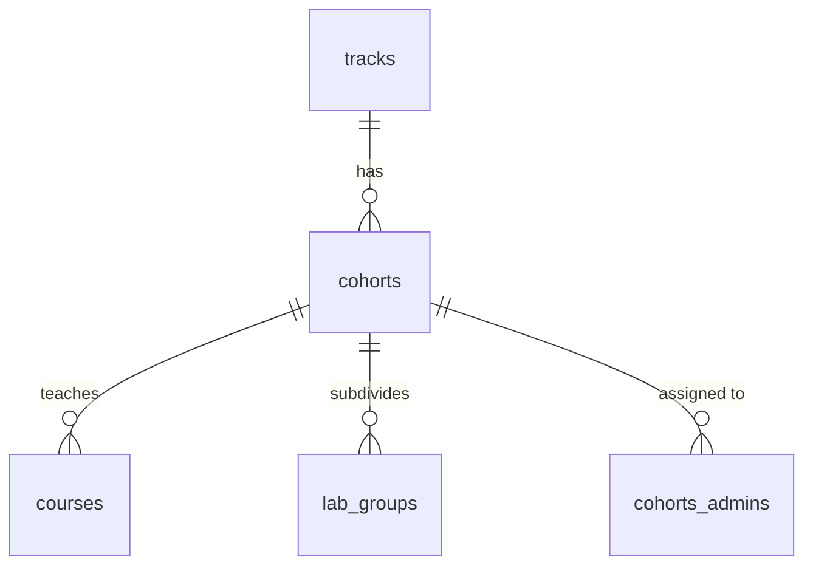
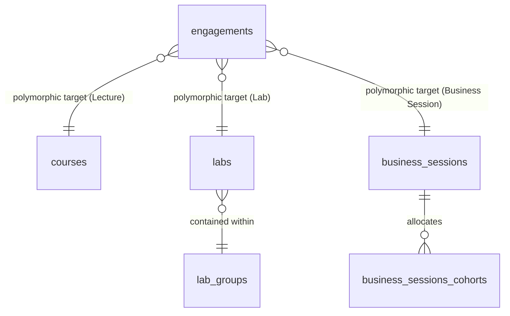
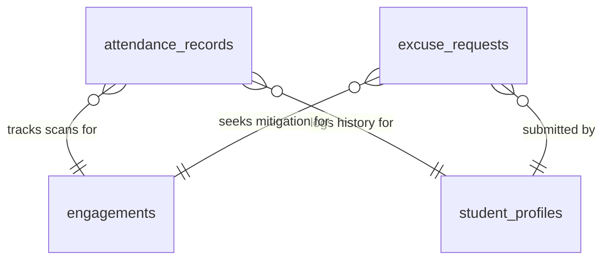
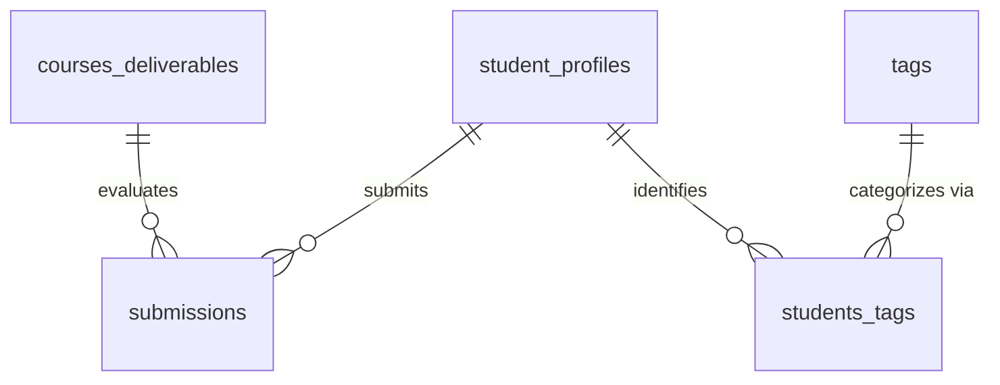
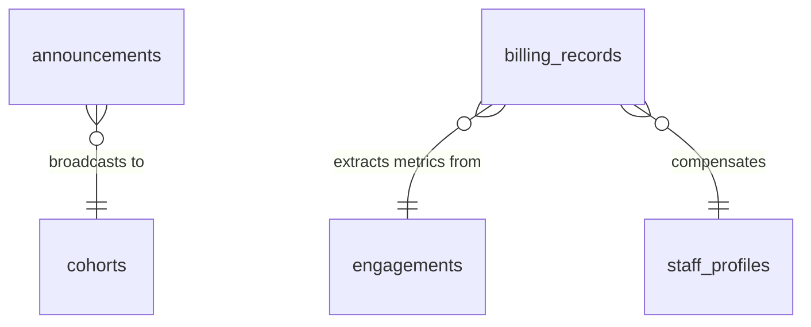

# Attendance & Grading Platform — Laravel 13 API

A stateless, headless REST API backend built with **Laravel 13**, **PHP 8.3**, and **PostgreSQL**.  
Designed to serve a separate Vue frontend. No sessions, no Blade, no assets — pure JSON.

## Related Docs

- [Requirements](docs/api/requirements.md)
- [API Design Guidelines](docs/api/design-guidelines.md)
- [API Endpoints](docs/api/endpoints.md)
- [DB Schema](docs/db/schema.dbml)

---

## Table of Contents

- [Requirements](#-requirements)
- [Project Setup](#-project-setup)
- [Database Schema](#-database-schema)
- [Project Structure](#-project-structure)
- [Testing](#-testing)
- [Maintenance Commands](#-maintenance-commands)
- [Contributor Guidelines](#-contributor-guidelines)
- [Related Repositories](#-related-repositories)

---


## 📋 Requirements

| Requirement | Version |
|-------------|---------|
| PHP | 8.3+ |
| Composer | 2.x |
| PostgreSQL | 15 / 16 |
| Git | latest |

---

## 🚀 Project Setup

### 1. Clone the repository

```bash
git clone https://github.com/AndrewEmad14/attendance-and-grading-platform-backend
cd attendance-and-grading-platform-backend
```

### 2. Copy environment file

```bash
cp .env.example .env
```

### 3. Install PHP dependencies

```bash
composer install --optimize-autoloader
```

> For CI / production, add `--no-dev` to exclude dev-only packages.

### 4. Generate application key

```bash
php artisan key:generate
```

### 5. Configure your `.env`

Fill in at minimum:

```dotenv
APP_NAME="Attendance & Grading Platform"
APP_ENV=local
APP_DEBUG=true
APP_URL=http://localhost:8000

DB_CONNECTION=pgsql
DB_HOST=127.0.0.1
DB_PORT=5432
DB_DATABASE=your_db_name
DB_USERNAME=your_db_user
DB_PASSWORD=your_db_password

SANCTUM_STATEFUL_DOMAINS=localhost:5173  # Your Vue dev server
```

### 6. Run migrations

```bash
php artisan migrate --force
```

### 7. Publish and run Sanctum migrations

```bash
php artisan vendor:publish --tag=sanctum-migrations
php artisan migrate
```

### 8. (Optional) Seed initial data

```bash
php artisan db:seed --force
```

### 9. Start the development server

```bash
php artisan serve
```

API is now available at `http://127.0.0.1:8000/api`.


---

## 🗄️ Database Schema Mapping

The system schema is fully normalized and organized across six relational domains. Foreign key relations crossing distinct domain boundaries use clear logical mapping definitions.



---

### 1. Users & Profiles

Every person in the system is a `users` row. Role-specific data lives in a separate profile table — `student_profiles` for students, `staff_profiles` for all staff (instructors, track admins).



---

### 2. Academic Hierarchy & Organization

The hierarchy is: a `track` (e.g. Web Dev) contains `cohorts` (one active at a time), each cohort contains `courses`, and each course is split into `lab_groups` of ~15 students.



---

### 3. Engagements & Polymorphic Scheduling

An `engagement` is a polymorphic teaching booking — it can be attached to a `course`, a `lab`, or a `business_session`. Business sessions can span multiple cohorts via `business_sessions_cohorts`.



---

### 4. Attendance & Mitigation Operations

Tracks explicit student scanning logs alongside submitted excuse requests. Following architectural optimizations, **`excuse_requests` link directly to engagements and student profiles**, eliminating the direct dependency on individual scan rows.



---

### 5. Grading, Performance Submissions & Tags

Manages structural course metrics, tracking student workspace project deliverables, evaluation feedback loops, overrides, and performance metadata tag arrays.



---

### 6. Communications, Logistics & Operations Billing

Maintains targeted internal communications channels alongside ledger components for checking performed staff operational hours against engagements.



---

## 📁 Project Structure

```
app/
├── Exceptions/
│   └── Handler.php                  # Maps exceptions to JSON responses
├── Http/
│   ├── Controllers/
│   │   └── Api/
│   │       ├── Auth/                # Login, register, password reset
│   │       ├── AttendanceController.php
│   │       ├── CourseController.php
│   │       ├── GradeController.php
│   │       └── StudentController.php
│   ├── Middleware/
│   │   └── ForceJsonResponse.php    # Ensures Accept: application/json
│   ├── Requests/
│   │   ├── Attendance/
│   │   ├── Course/
│   │   ├── Grade/
│   │   └── Student/
│   └── Resources/
│       ├── AttendanceResource.php
│       ├── CourseResource.php
│       ├── GradeResource.php
│       └── StudentResource.php
├── Models/
├── Policies/
├── Services/
└── Traits/
config/
routes/
├── api.php
└── console.php
database/
├── migrations/
├── seeders/
└── factories/
tests/
├── Feature/
│   └── Api/                         # One file per controller
└── Unit/
    └── Services/                    # Unit tests for Service classes
```

> **Note:** `web.php`, `vite.config.js`, `package.json`, `resources/views/`, and `resources/js/` have been removed — this is a headless API.

---


## 🧪 Testing

Every endpoint **must** have a feature test before it is merged.

### Run all tests

```bash
php artisan test
```

### Run a specific test

```bash
php artisan test --filter=AttendanceTest
php artisan test --filter="AttendanceTest::test_instructor_can_record_attendance"
```

### Feature test structure

```php
// tests/Feature/Api/AttendanceTest.php
class AttendanceTest extends TestCase
{
    use RefreshDatabase;

    public function test_instructor_can_record_attendance(): void
    {
        $instructor = User::factory()->instructor()->create();
        $session    = CourseSession::factory()->for($instructor)->create();
        $student    = Student::factory()->create();

        $this->actingAs($instructor, 'sanctum')
             ->postJson('/api/attendance', [
                 'session_id' => $session->id,
                 'student_id' => $student->id,
                 'status'     => 'present',
             ])
             ->assertStatus(201)
             ->assertJsonPath('data.status', 'present');

        $this->assertDatabaseHas('attendance', [
            'session_id' => $session->id,
            'student_id' => $student->id,
        ]);
    }

    public function test_student_cannot_record_attendance(): void
    {
        $student = User::factory()->student()->create();

        $this->actingAs($student, 'sanctum')
             ->postJson('/api/attendance', [])
             ->assertStatus(403);
    }

    public function test_unauthenticated_request_returns_401(): void
    {
        $this->postJson('/api/attendance', [])->assertStatus(401);
    }

    public function test_invalid_data_returns_422(): void
    {
        $instructor = User::factory()->instructor()->create();

        $this->actingAs($instructor, 'sanctum')
             ->postJson('/api/attendance', ['status' => 'flying'])
             ->assertStatus(422)
             ->assertJsonValidationErrors(['session_id', 'student_id', 'status']);
    }
}
```

### Testing checklist per endpoint

- [ ] Happy path (valid data, correct role) → correct status + response shape
- [ ] Unauthenticated → `401`
- [ ] Wrong role → `403`
- [ ] Invalid input → `422` with correct error keys
- [ ] Non-existent resource → `404`

---

## 🧹 Maintenance Commands

| Command | Purpose |
|---------|---------|
| `php artisan optimize:clear` | Clear all cached config, routes, and views |
| `php artisan config:cache` | Cache configuration for performance |
| `php artisan route:cache` | Cache route list for performance |
| `php artisan route:list` | Inspect all registered API routes |
| `php artisan tinker` | Interactive REPL (avoid in production) |
| `php artisan db:wipe` | Drop all tables — use with caution |
| `php artisan migrate:fresh --seed` | Rebuild DB and reseed (dev only) |

---

## ❗ Contributor Guidelines

### Hard rules

- **Never** use `session()` — this is a stateless API.
- **Never** return `view()` or `redirect()` — always JSON.
- **Never** return raw Eloquent models — always use API Resources.
- **Never** validate inside controllers — always use Form Requests.
- **Never** write business logic in controllers — use Services.
- **Never** query inside a loop — always eager load with `with()`.
- **Never** merge a PR without tests for every endpoint you touched.

### Code style

Follows **PSR-12** and Laravel conventions. Run before committing:

```bash
./vendor/bin/pint
```

### Git workflow

```
main        → production-ready only, protected branch
develop     → integration branch, all PRs target here
feature/xyz → feature branches from develop
fix/xyz     → bug fixes from develop
```

Commit message format:

```
feat: add grade submission endpoint
fix: prevent duplicate attendance records
refactor: move GPA logic into GradeService
test: add coverage for CourseController
```

### PR checklist

- [ ] All tests passing (`php artisan test`)
- [ ] Code formatted (`./vendor/bin/pint`)
- [ ] API Resources used for all output
- [ ] Business logic moved to a Service class if non-trivial
- [ ] `.env.example` updated if new env variables were added
- [ ] Migration `down()` method is correct and reversible

---

## 🔗 Related Repositories

- [**Frontend (Vue) Repo** ](https://github.com/AndrewEmad14/attendance-and-grading-platform-frontend)
- [**Backend (Laravel) Deployed API** ](https://attendance-and-grading-backend-production.up.railway.app/api)
- [**Frontend (Vue) Deployed Website** ](https://attendance-and-grading-platform.vercel.app/)