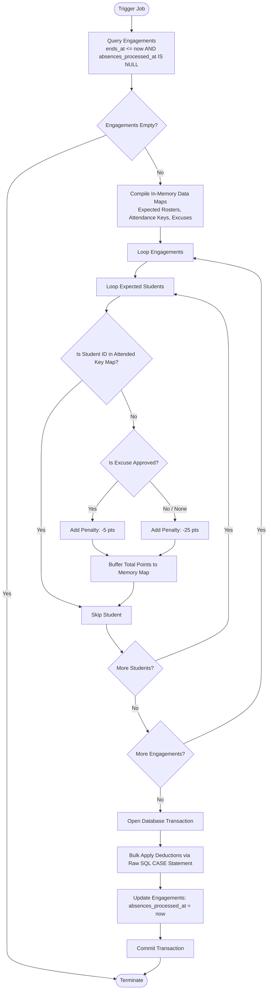

# Attendance & Excuses System Architecture

This document details the functional specifications, data models, workflows, permissions, and synchronization patterns governing the tracking of student attendance, absence penalties, and excuse management.

---

## 1. Core Architecture & Data Models

The module is built on an atomic transactional framework designed to optimize performance ($N+1$ query prevention) and eliminate point-deduction drift across scheduled automated operations.

### Database Tables

#### `attendance_records`
Tracks student check-in and check-out activities per engagement.

| Column | Type | Constraints / Indexes | Description |
| :--- | :--- | :--- | :--- |
| `id` | int | Primary Key |  |
| `engagement_id` | int | Foreign Key | Cascades on delete.  Indexed |
| `student_id` | int | Foreign Key | Cascades on delete. Indexed. |
| `arrived_at` | timestamp | Nullable | Records the check-in time scan. |
| `left_at` | timestamp | Nullable | Records the check-out time scan. |

#### `engagements`
Polymorphic scheduling core mapping out track sessions.

| Column | Type | Constraints / Indexes | Description |
| :--- | :--- | :--- | :--- |
| `id` | int | Primary Key |  |
| `absences_processed_at` | timestamp | Nullable | State lock flag. If populated, protects against re-processing. |
| `starts_at` | timestamp | | Session start time. Indexed. |
| `ends_at` | timestamp |  | Session end time. Indexed. |
| `engageable_type` | string |  | Targets: `Course`, `Lab`, or `BusinessSession`. Indexed. |
| `engageable_id` | int | Foreign key | Primary key of target class. |

#### `excuse_requests`
Maintains documentation submitted by students seeking penalty relief.

| Column | Type | Constraints / Indexes | Description |
| :--- | :--- | :--- | :--- |
| `id` | int | Primary Key |  |
| `engagement_id` | int | Foreign Key | Reference to `engagements`. |
| `student_id` | int | Foreign Key | Reference to `student_profiles`. Unique composite: `(student_id, engagement_id)`. |
| `reason` | text | None | Text justification for absence. |
| `attachment_path` | string | Nullable | File path: `storage/app/public/excuses/`. |
| `status` | enum | Default: `pending` | Allowed values: `pending`, `approved`, `rejected`. |
| `reviewed_by` | int | Foreign Key | References `staff_profiles`. Nullable. |
| `reviewed_at` | timestamp | Nullable | Time indicator of review decision. |

---

### Architectural Performance Utilities

To prevent performance degradation during batch scans, the `Engagement` model utilizes three performance utilities that execute data consolidation out-of-loop using in-memory `Support\Collection` mappings:

* **`expectedStudentIdsForMany(Collection $engagements): array`**
  Eager-loads target polymorphic entities via `loadMissing('engageable')`. It aggregates structural parameters (cohort IDs, lab group IDs, or business session pivots) into localized query blocks, resolving expected rosters in a unified statement. Returns: `[engagement_id => [student_id]]`.
* **`attendedStudentIdsForMany(Collection $engagements): Collection`**
  Extracts completed check-ins. Chains a `->map(fn() => ...->flip())` calculation to change student IDs into array *keys* rather than *values*. This allows downstream engines to utilize native PHP `isset()` tracking for efficient $O(1)$ complexity lookups. Returns: `[engagement_id => [student_id => array_index]]`.
* **`excuseRequestsForMany(Collection $engagements): Collection`**
  Pulls related excuse logs in a single query, indexing them via `keyBy('student_id')`. Returns: `[engagement_id => [student_id => ExcuseRequest]]`.

---

## 2. Dynamic Workflow Operations

### Active Scanning Process (`POST /api/attendance`)

The system uses a strict check-in/check-out model via a single endpoint. Scans are entirely idempotent within specified session thresholds.

```mermaid
graph TD
    A[Student Scan Request] --> B{Within [starts_at, ends_at] Window?}
    B -- No --> C[Abort 422: Window Closed]
    B -- Yes --> D[Execute firstOrCreate on Record]
    D -- Record Created --> E[Set arrived_at = now<br>Return HTTP 201]
    D -- Record Exists: left_at is NULL --> F[Set left_at = now<br>Return HTTP 200]
    D -- Record Exists: left_at is SET --> G[Idempotent Bypass: Maintain State<br>Return HTTP 200]
```

---

### Automated Auditing Worker (`ProcessAbsences`)

The core background command (`php artisan attendance:process-absences`) processes absences and handles score updates inside a database transaction block.



---

## 3. Balance Calculations & Lifecycle Edge Cases

The system applies three core balance values:

| Occurrence State | Balance Adjustment Impact | 
| :--- | :--- |
| **Attended Session** | 0 points change |
| **Unexcused Absence** | −25 points penalty |
| **Approved Excuse** | −5 points penalty |

---

### The Proactive Approval Edge Case Fix

A critical bug arises if an excuse is approved **before** the cron job processes the absence. Under simple logic, the approval immediately grants a $+20$ point refund, and then the cron job applies a $-5$ penalty later, giving the student a net **$+15$ bonus** for being absent.

To resolve this, the system uses a conditional balance check in `ExcuseService::review()` based on the state of the `absences_processed_at` timestamp.

#### Operational State Changes Matrix


```mermaid

[Scenario A: Standard Execution Pipeline]
Engagement Concludes -> Cron Job Processes Absence (-25) -> Admin Approves Excuse (+20 Refund)
Result: Net -5 Deduction (Correct)

[Scenario B: Proactive Review Pipeline (Loophole Prevented)]
Engagement Concludes -> Admin Approves Excuse -> System checks 'absences_processed_at' (Null) -> Skips +20 Refund
-> Cron Job Runs Later -> Evaluates Approved Status -> Applies -5 Penalty Directly
Result: Net -5 Deduction (Correct)

```

---

## 4. Attendance Ledger Architecture

The engine generates ledger balance listings using a clean data separation pattern. The current user balance is read directly from the authoritative `student_profiles.attendance_balance` database column, while row items are calculated independently in-memory via `AttendanceLedgerService::buildLedger`.

### Response Payload Structure (`GET /api/students/{id}/attendance-ledger`)

```json
{
  "data": {
    "student": {
      "id": 41,
      "name": "Jane Doe",
      "current_balance": 970
    },
    "entries": [
      {
        "engagement_id": 102,
        "engagement_type": "lecture",
        "name": "Systems Architecture II",
        "date": "2026-06-11T19:00:00.000Z",
        "arrived_at": "2026-06-11T19:02:11.000Z",
        "left_at": "2026-06-11T20:55:00.000Z",
        "absence_status": "present",
        "excuse_status": null,
        "deduction": 0
      },
      {
        "engagement_id": 103,
        "engagement_type": "lab",
        "name": "Distributed Storage Lab",
        "date": "2026-06-12T14:00:00.000Z",
        "arrived_at": null,
        "left_at": null,
        "absence_status": "absent",
        "excuse_status": "approved",
        "deduction": -5
      }
    ]
  }
}

```

---

## 5. Integrated Endpoint, Policy & Access Matrix

### Legend
* ✅ **Allowed** | ❌ **Denied**
* 👤 **Own Records Only** (Enforced via Profile ID matching)
* 🌐 **Scoped Access** (Enforced via `AccessService::canAccessStudent`)
* ⏳ **Conditional** (Allowed only if status is `pending`)

| Route Endpoint | Method | Controller Action | Bound Policy Method | Student | Instructor | Track Admin | Branch Manager |
| :--- | :---: | :--- | :--- | :---: | :---: | :---: | :---: |
| `/api/attendance` | `GET` | `index` | *Scoped Query Filter* | 👤 | 🌐 | 🌐 | 🌐 |
| `/api/attendance/{id}` | `GET` | `show` | `AttendancePolicy@view` | 👤 | 🌐 | 🌐 | 🌐 |
| `/api/attendance` | `POST` | `store` | `AttendancePolicy@create` | ✅ | ❌ | ❌ | ❌ |
| `/api/attendance/{id}` | `PATCH` | `update` | `AttendancePolicy@update` | ❌ | 🌐 | 🌐 | 🌐 |
| `/api/students/{id}/attendance-ledger` | `GET` | `show` | *Direct Scope Check* | 👤 | ❌ | 🌐 | 🌐 |
| `/api/excuse-requests` | `GET` | `index` | `ExcuseRequestPolicy@viewAny` | 👤 | ❌ | 🌐 | 🌐 |
| `/api/excuse-requests/{id}` | `GET` | `show` | `ExcuseRequestPolicy@view` | 👤 | ❌ | 🌐 | 🌐 |
| `/api/excuse-requests` | `POST` | `store` | `ExcuseRequestPolicy@create` | ✅ | ❌ | ❌ | ❌ |
| `/api/excuse-requests/{id}` | `PATCH` | `update` | `ExcuseRequestPolicy@update` | 👤 + ⏳ | ❌ | ❌ | ❌ |
| `/api/excuse-requests/{id}/approve` | `POST` | `approve` | `ExcuseRequestPolicy@review` | ❌ | ❌ | 🌐 | ❌ |
| `/api/excuse-requests/{id}/reject` | `POST` | `reject` | `ExcuseRequestPolicy@review` | ❌ | ❌ | 🌐 | ❌ |

---

## File Storage Map

| Directory Asset Location | Accessibility Context | Security Status | System Framework Purpose |
| :--- | :--- | :--- | :--- |
| `storage/app/public/excuses/` | 🔓 **Public Symlink** | Gitignored (`.gitignore`) | Student verification files, images, and documents. |
| `storage/logs/attendance_absences.log` | 🔒 **Protected (Server Only)** | Gitignored (`.gitignore`) | Background cron engine execution trace logs. |
